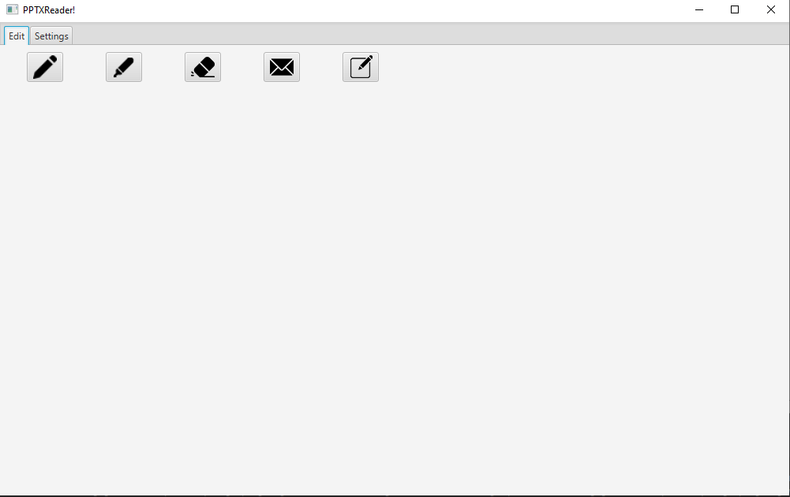
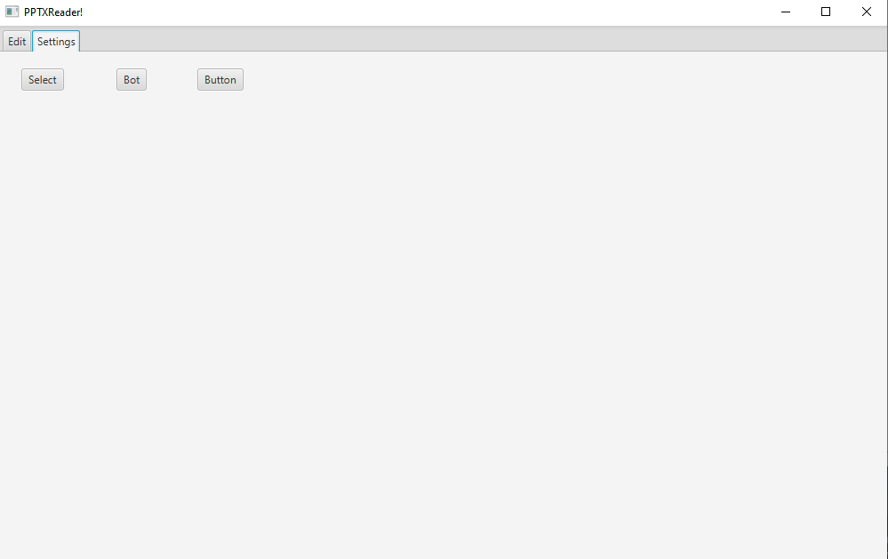
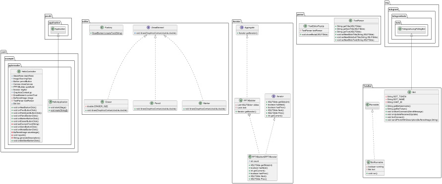
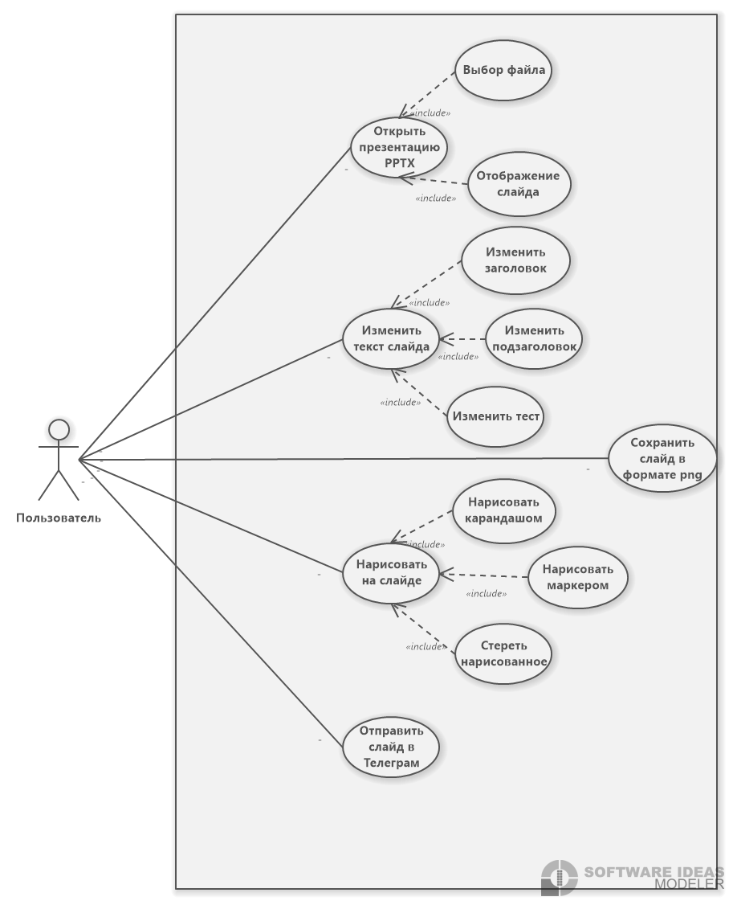

# Панель лектора системы поддержки активности аудитории 
**Описание:** В данном репозитории представлена программа для редактирования файлов формата pptx, с возможностью отправки измененного слайда в Telegram. 
В ней применен такой паттерн как Iterator, который позволяет производить итерацию по слайдам презентаций. 
Для использования данного приложения вам необходимо:
* **Технологический стек**:  Java.;  Telegram 
* **Статус**: v1.0.0;

**Скриншот рабочего окна приложения:**

## Архитектура
**Скриншоты диаграмм:**

## Зависимости
Язык программироваия **Java**, комплект разработчика приложений **JDK 21**, инструментарий GUI **JavaFX**, также API TelegramBot. 
## Конфигурация
Для данного ПО не требуется специальная настройка
## Применение
Для использования данной программы вам необходимо:
* Выбрать файл который Вы хотите отредактировать;
* Запустить бота;
* Внести необходимые правки;
* Нажать на кнопку отправки;

